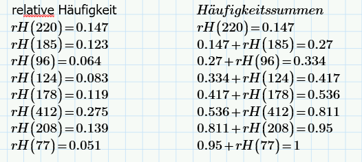
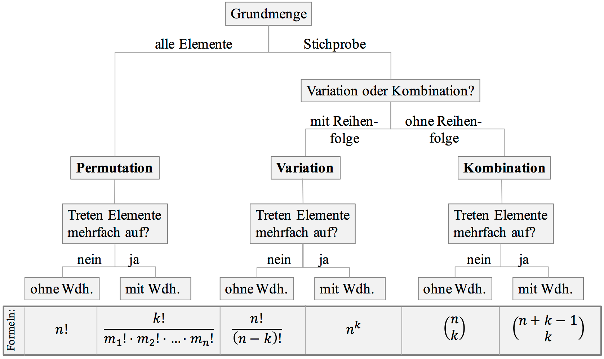
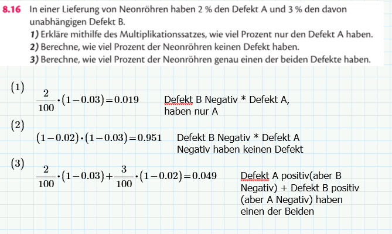
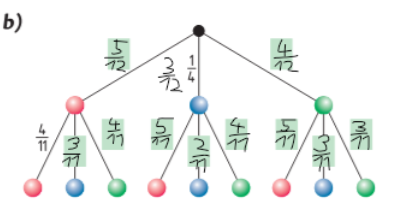
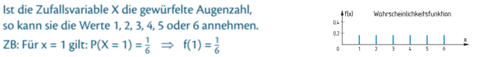
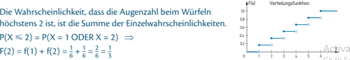

# Mathe Schularbeit
# Inhaltsverzeichnis

## 1. Statistik
### 1.1 Häufigkeiten
- [1.1.1 Absolute Häufigkeit](#absolute-häufigkeit)
- [1.1.2 Relative Häufigkeit](#relative-häufigkeit)
- [1.1.3 Prozentuelle Häufigkeit](#prozentuelle-häufigkeit)
- [1.1.4 Häufigkeitssumme](#häufigkeitssumme)

### 1.2 Kennzahlen statistischer Verteilung
- [1.2.1 Arithmetisches Mittel (Durchschnitt)](#arithmetisches-mittel-durchschnitt)
- [1.2.2 Median](#median)
- [1.2.3 Quartil](#uartil)

### 1.3 Streuungsmaße
- [1.3.1 Spannweite](#spannweite)
- [1.3.2 Quartilsabstand (Interquartilsabstand)](#quartilsabstand-interquartilsabstand)
- [1.3.3 Varianz](#varianz)
- [1.3.4 Standardabweichung](#standardabweichung)

### 1.4 Boxplot
- [1.4.1 Ablesen](#ablesen)
- [1.4.2 Erstellen (Mathcad)](#erstellen-mathcad)

## 2. Kombinatorik
- [2.1 Permutation (Anordnung)](#permutation-anordnung)
  - [2.1.1 Ohne Wiederholung](#ohne-wiederholung)
  - [2.1.2 Mit Wiederholung](#-mit-wiederholung)
- [2.2 Variation (Auswahl)](#variation-auswahl)
  - [2.2.1 Ohne Wiederholung](#ohne-wiederholung)
  - [2.2.2 Mit Wiederholung](#-mit-wiederholung)
- [2.3 Kombination](#kombination)

## 3. Wahrscheinlichkeitsrechnung
### 3.1 Grundlagen
- [3.1.1 Laplace-Experiment](#laplace-experiment)
- [3.1.2 Multiplikationssatz](#multiplikationssatz)
- [3.1.3 Baumdiagramm](#baumdiagramm)

### 3.2 Zufallsvariablen
- [3.2.1 Wahrscheinlichkeitsfunktion](#wahrscheinlichkeitsfunktion)
- [3.2.2 Verteilungsfunktion](#verteilungsfunktion)

### 3.3 Wichtige Verteilungen
- [3.3.1 Binomialverteilung](#binomialverteilung)
- [3.3.2 Hypergeometrische Verteilung](#hypergeometrische-verteilung)
- [3.3.3 Poisson-Verteilung](#poisson-verteilung)
- [3.3.4 Normalverteilung](#normalverteilung)

## Statistik

### Häufikgeiten

#### absolute Häufigkeit 
- wie oft eine Zahl in der Datenmenge vorkommt
- $H(x) = \text{Anzahl der Vorkommen von } x$

#### relative Häufigkeit 
- wie oft eine Zahl relativ zu den anderen in der Datenmenge vorkomt
- $H(x) = \frac{\text{absolute Häufigkeit}}{\text{Gesamtanzahl}}$.

#### Protzentuelle Häufigkeit 
- wie oft eine Zahl protzentuell zu den anderen in der Datenmenge vorkomt
- $\text{Prozentuelle Häufigkeit} = \frac{H(x)}{n} \cdot 100$

#### Häufigkeitssumme
- alle bissherigen relative Häufigkeiten addiert
- 
- zuerst nur die erste -> erste und zweite -> erste und zweite und dritte, usw. (am Ende kommt 1 raus)

### Kennzahlen Statistische Verteilung

#### Arethmetisches Mittel (Durchschnitt)

- Taschenrechner:
    - $\frac{\text{Alle summierten Werte}}{\text{Anzahl der Werte}} = \text{Arithmetisches Mittel}$

- Mathcad:
    - $\text{mean}(\text{zahl1}, \text{zahl2}, \text{zahl3}) = \text{Arithmetisches Mittel}$

#### Median
- der Zentralwert in der geordneten Liste
- $\text{median}(\text{zahl1}, \text{zahl2}, \text{zahl3}) = \text{Median}$

#### Quartil 
- quasi der Median vom Median gibts im ersten viertel und dritten viertel
- $\text{percentile(Daten, 0.25)}(\text{zahl1}, \text{zahl2}, \text{zahl3}) = \text{erstes Quartil}$
- $\text{percentile(Daten, 0.75)}(\text{zahl1}, \text{zahl2}, \text{zahl3}) = \text{zweites Quartil}$

### Streuungsmaße
#### Spannweite
- Differenz zwischen dem größtem und kleinstem Wert
- $\text{Spannweite} = (\text{xMax}) - (\text{xMin})$
#### Quartilsabstand (Interquartilsabstand)
- Spannweite zwischen q1 und q3
- $\text{Quartilsabstand} = (\text{q3}) - (\text{q1})$
#### Varianz
- Varianz = (möglicher Wert1 - Erwartungswert)^2*Wahrscheinlichkeit + (möglicher Wert1 - Erwartungswert)^2*Wahrscheinlichkeit + usw.
- Mathcad
    - $\text{var(Daten)} = (\text{Varianz})$

#### Standardabweichung
- Wurzel aus der Varianz 
- wie weit die werte im durchschnitt vom Druchschnitt entfernt sind
$s = \sqrt{\frac{1}{n-1} \sum_{i=1}^{n} (x_i - \bar{x})^2}$
- Mathcad
    - $\text{stdev(Daten)} = (\text{Varianz})$

### Boxplot 
- Ablesen
    - Max
    - Min
    - Median
    - 1 Quartil
    - 3 Quartil
- Erstellen Mathcad
    1) Insert Plot
    2) 1*5 Matrix ertsellen
    3) befüllen [q1, Median, q3, min, Max]
    4) bei der y-achse übergeben
    5) bei der x-achse den Namen übergeben in ""
    6) change Type -> Box Trace

## Kombinatorik

- Anzahl von Möglichkeiten in verschiedenen Situationen zu berechnen
### Permutation (Anordnung):
- Reihenfolge von Objekten zu betrachten
- es werden n Elemente auf n plätzen angeordnet
- Beispiel: Wie viele verschiedene Reihenfolgen gibt es für die Buchstaben 𝐴, 𝐵, 𝐶?
- #### Permutation ohne Wiederholung
    - beachte ob alle Elemente voneinader unterscheidbar sind
    - wenn ja kann man die Möglichkeiten berechnen mit
    -   ${AnordnungsMöglichkeiten} = {n!}$
- #### Permutation mit Wiederholung
    - wenn manche elemnte nicht unterschreibar sind (bsp rot, gelb, gleb, grün, grün <- gelb/gelb und grün/grün kann man nicht unterscheiden)
    - $\frac{n!}{k1! * k2!} = AnordnungsMöglichkeiten$
    - k1... gelb
    - k2... grün

### Variation (Auswahl):
- quasi die Permutation nur werden nicht alle genommen sondern nur eine teilmenge von n
- Beispiel: Wie viele verschiedene Reihenfolgen gibt es für die Buchstaben 𝐴, 𝐵, 𝐶? Aber nur 2er Kombis (AB, AC, ..)
    - ##### Variaton ohne Wiederholung
        - kann jedes Element nur einmal auswähle (Ziehen ohne zurücklegen)
        - (bsp. ABC: AA darf es nicht geben)
        - $V = \frac{n!}{(n-k)!}$
        - n.. alle elemente
        - k.. wie viele gezogen werden
        - V.. Variation
    -  ##### Variation mit Wiederholung
        - das selbe Element kann öfter gezogen werden
        - (bsp ABC: AA darf es geben)
        - $V = n^k$
        - n.. Anzahl der Möglichkeiten
        - k.. Anzahl der Wahlen (wie oft du auswählst).

### Kombination
- Reihenfolge ist egal
- Beispiel: Wie viele Möglichkeiten gibt es, 2 Leute aus einer Gruppe von 5 auszuwählen?
- $\binom{n}{k}$
- $\frac{n!}{k! \cdot (n-k)!}$

## Wahrscheinlichkeitsrechnung
### Laplace-Experiment
- ein Zufallexperiment ist ein Laplace-Experiment, wenn
    - Jedes Mögliche ergebnis die gleiche chance hat einzutreten
    - beliebig oft wiederholbar, chancen ändern sich nicht
- Berechnung: $\frac{alle Günstigen Fälle}{alle möglichen Fälle}$

### Multiplikationssatz
- Wenn sich ein Zufallsexperiment aus mehreren einzelnen schritten zusammensetzt multipliziert man die ergebnisse der einzelnen schritte
- Bsp. 

### Baumdiagramm
- dienen zur darstellung von mehrstufigen Versuchen, die Berechnung der Wahrscheinlichkeiten erfolgt mithilfer der Pfadregel
- 

## Wahrscheinlichkeitsrechnung
- Zufallsvariable ordnet jedem ausgang eine Zahl zu 
    - diskrete Zufallsvariable: abzählbar
    - stetige Zufallsvariable: alle Werte innerhalb eines Intervals
- Wahrscheinlichkeitsfunktion ordnet Zufallsvariable X die wahrscheinlichkeit zu dass X genau diesen Wer annimmt
    - $f(x_i) = P(X = x_i)$
    - bsp. 
- Verteilungsfunktion F ordnet einer diskreten Zufallsvariable X die Wahrscheinlichkeit zu, dass X höchstens diesen Wert annimmt
    - $f(x_i) =< P(X = x_i)$
    - 

### Binomialverteilung
- **genau zwei ergebnisse möglich**
- **Ziehen mit Zurücklegen**
- bei jeder durchführung ist die Wahscheinlichkeit für Erfolg gleich
- beliebig viele wiederholungen möglich

### Hypergeometrische Verteilung
- **Ziehen ohne Zurücklegen**
- **genau zwei Ergebnisse möglich**

## Poisson-Verteilung
- **näherung der Binomialverteilung**
- **μ** muss mit **geändertem Zeitraum/Population multipliziert** werden
    - bsp. μ pro Stunde = 1.2, μ für 4 Stunden gleich 4.8
    - bsp. μ pro Person 21%, μ für 3000 Personen 630

## Normalverteilung
- **stetige Zufallsvariable**
- μ... Erwartungswert, Maximum stelle im Graphen
- σ... Standardabweichung der Verteilung, Breite des Graphen 
- Wendestellen $x = μ \pm σ$
- Wendetangente $x = μ \pm 2σ$ 
- Gesammtfläche der Glocke 1
- **σ berechnen** mithilfe von
    - μ, Zufallswert, Wahrscheinlichkeit vom Zufallswert, x.. Vraiable für σ
    - Geogebra: 
        - $gl1: Normal(μ, x, Zufallswert) = Wahrscheinlichkeit vom Zufallswert$
        - $NLöse(gl1)$