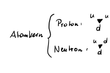
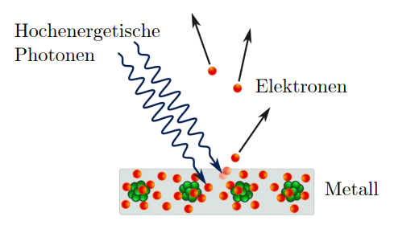
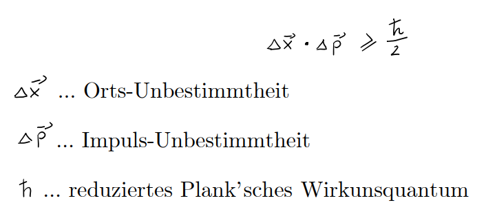
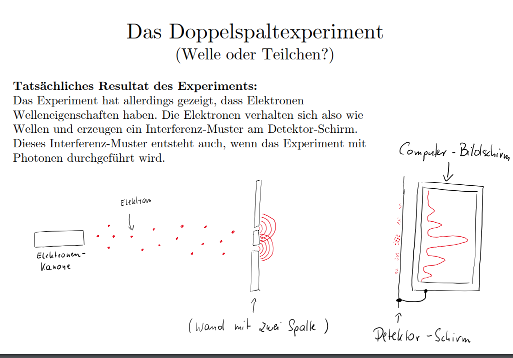
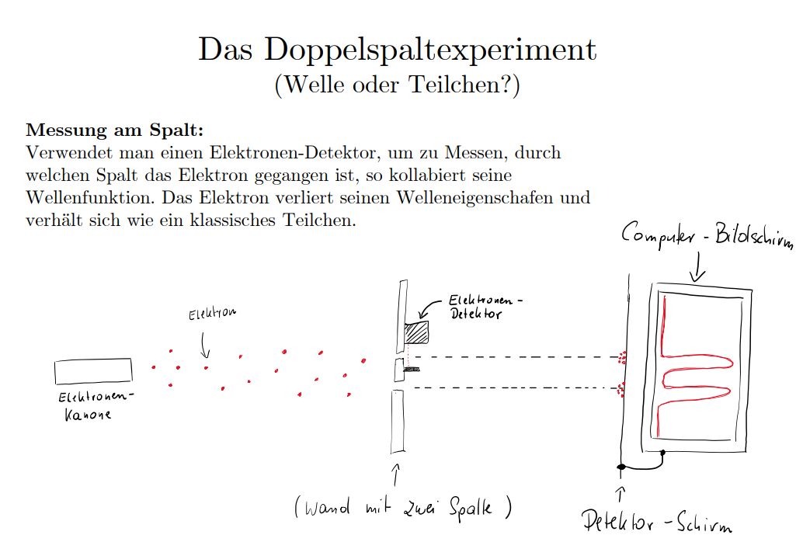
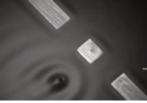

# Physik Test

## 7 Quantenphysik

#### Diskret vs. Kontinuierlich:

Materie ist diskret
Diskret: nur bestimmte zustände sind erlaubt (ganzen Zahlen)
Energie ist kontinuierlich
Kontinuierlich: unendlich viele Zustände (reelen Zahlen)

#### Weltbild der Physik um 1900:

Materie ist diskret:
Materie = alles was Platz braucht und Masse hat
Die kleinsten Bauteile sind Quarks deswegen diskret
1900: Energie ist kontinuierlich (<- dachte man ist aber Falsch)
heute: Energie ist diskret
Man dachte Energie wird in Form von Wellen übertragen
Dies stellt sich als Falsch heraus Energie kann nur in diskreten Paketen abgegeben und aufgenommen werden.
Atommodell
1900:
Nils Bohr: (<- Altes Atommodell):
guter Ansatz, erklärt aber nicht warum die negativ geladenen Elektronen nicht in den Positiv geladenen Kern stürzen
mögliche Antwort:
Erwin Schrödinger
Elektronen, Protonen, Neutronen sind werde Welle noch Teilchen
je nach Experiment Wellen oder Teilchen Eigenschaften
Albert Einstein mochte die Theorie nicht, da sie mit Wahrscheinlichkeiten arbeitetet
Das Weltbild von Heute:
Fast alles, was wir beobachten und messen können (Materie und Wechselwirkung) sind Quanten.
Quanten sind weder Teilchen noch Welle je nach Experiment verhalten sie sich wie Teilchen oder wie eine Welle
bekannte Quanten: 12 Fermionen und 5 Bosonen

Atommodell heute:

#### Schwarzer Körper – Quantisierung des Lichts - Max Planck:

Früher konnte man sich nicht erklären warum heißes Metall die Farbe ändert (glüht)
Max Planck eine Theorie, um das Strahlungsspektrum zu erklären (<- er hofft das er falsch liegt)
Annahmen:
Licht besteht aus Teilchen (Photonen)
da es aus Photonen besteht kann es nur diskret sein
seine Theorie steht im (scheinbaren) Wiederspruch zu den Beugungs- und Brechungseffekten des Lichts
Wissensstand heute:
Licht weder Welle noch Teilchen
hat je nach Experiment Wellen- oder Teilchen Eigenschaften
Zussammenhang zwischen Frequenz und Energie eines Photons:
E = h * f
E.. Energie in Joule
h.. Plank‘sches Wirkungsquantum ℎ ≈ 6.6 ∙ 10−34 Joule-Sekunden
f.. Frequenz in hz (Anzahl der Schwingungen je Sekunde)
hz = 1/s
Frequenz ist der Kehrwert der Wellenlänge
Je größer die Frequenz, umso größer die Energie.
Je kleiner die Wellenlänge, umso größer die Energie.
Die Frequenz (bzw. Wellenlänge) bestimmt auch die Farbe des Lichts:
blaues Licht = viel Energie
rotes Licht = wenig Energie

#### Der Photoeffekt (Albert Einstein)

Hochenergetische Photonen (blaues Licht) können aus Metalloberflächen Elektronen herausschlagen.
Grundlage für Photovoltaikanlagen

#### Die 4 grundlängenden Wechselwirkungen und die „Lücke“ der Quantenphysik

4 grundlängende Wechselwirkungen:
Starke W.W. (Gluonen)
Schwache W.W. (Z-Bosonen, W-Bosonen)
Elektromagnetismus (Photon)
Gravitation (??? -> Die Quantenphysik bietet keine Erklärung für die Gravitation, vlt Graviton)

#### Das Heisenbergesche Unbestimmtheitsrelation (Unschärferelation)

Ort eines Quantenteilchens sehr genau messen, so wird sein Impuls sehr unbestimmt
Möchte man den Impuls eines Quantenteilchens sehr genau messen, so wird sein Ort sehr unbestimmt.
Früher dachte man:
Man braucht zum Messen mind. ein Photon. Wenn etwas aber mit einem Photon zusammenstoßt ändert sich der zustand. Deswegen können Ort und Impuls nicht zeitgleich gemessen werden.
Heute:
Die Messbarkeit unserer Welt ist Begrenzt!
Unbestimmtheitsrelation ist nicht wegen techninik sondern eine Eigenschaft der Natur
Das Doppelspaltexperiment:

#### Pilot Wave Theorie

Quantenteilchen als Teilchen verstanden, die selbst Wellen erzeugen, die die Bewegung des Teilchens beeinflussen.

Quantencomputer und Verschlüsselung:
Verschlüsselung heute:
RSA; Primzahlen werden verwendet
schwer für PC's zu rechnen (weil eine rechnung nach der andere)
einfach für Quantencomputer (können mehrere rechnungen gleichzeitig rechnen ( Superposition von Q-Bits) Bits sind nicht 0 oder 1 sondern können alles dazwischen auch sein)
neue Verschlüsselungsverfahren: Vektoren

## 8 Thermodynamik
Temperatur eines Körpers ist ein Maß für ungeordnete kinetische Energie (Bewegungsenergie) E der Molekühle eines Körpers
Mittlere Kinetische Energie:
Ekin=1/2*m*v^2

#### Celsius Skala
T (int Kelvin) = t (in ° Celsius) + 273
Absolute Nullpunkt = -273 °C
Im Absoluten Nullpunkt sind alle Molekühle in Ruhe
Ekin = 0

#### Wie kann Temperatur gemessen werden?
Volumenausdehnung Flüssigkeit: Hausthermometer
Volumenausdehnung Metal: Bügeleisen
Abhängigkeit des elektrischen Widerstandes: Widerstandthermometer
Kontaktspannung zwischen 2 Metallen: Thermoelement

#### Wärmekapazität C
Wärmemende die benötigt wird um einen Körper von der Temperatur T1 auf T2 zu erwährmen
C=Q/T
Q... Wärmemenge
C... Einheit = 1 Joule/Kelvin
T... T2 - T1

#### Spezifische Wärmekapazität

#### Allgemeine Gasgleichung

#### Isotherme Zustandsänderung
Gasgesetzt von Boyle Mariotte
bei einer isothermischen Zustandsänderung der Druck umgekehrt propotional zum Volumen V ist
p*V = constant,     T st Konstant
p.. druck
V... Volumen

#### isochore Zustandsänderung
V ist constant
p/T = constant

wenn in einem gleichbleibenden Volumen die Temperatur erhöhrt wird erhöhrt sich der druck und umgekehrt

#### isobare Zustandsänderung
druck Konstant

V/T = const

wenn der Druck Konstant ist und sich die Temperatur erhöht erhöht sich auch das Volumen

Die 4 Haupsätze der Thermodynamik
0)  Gesetz des thermischen Gleichgewichtes:  zwei Systeme die im Energieaustausch 
1)  Energieerhaltungssatz: Energie kann weder erschaffen noch vernichtet werden, nur umgewandelt
2)  Richtung der Energieübertragung: Energieübertragung von Warm zu Kalt nicht anderrum Entropie: Teilchen haben viele Anordnungsmöglichkeiten
3)  Stoff kann nicht auf den Absoluten nullpunkt abgekühlt werden