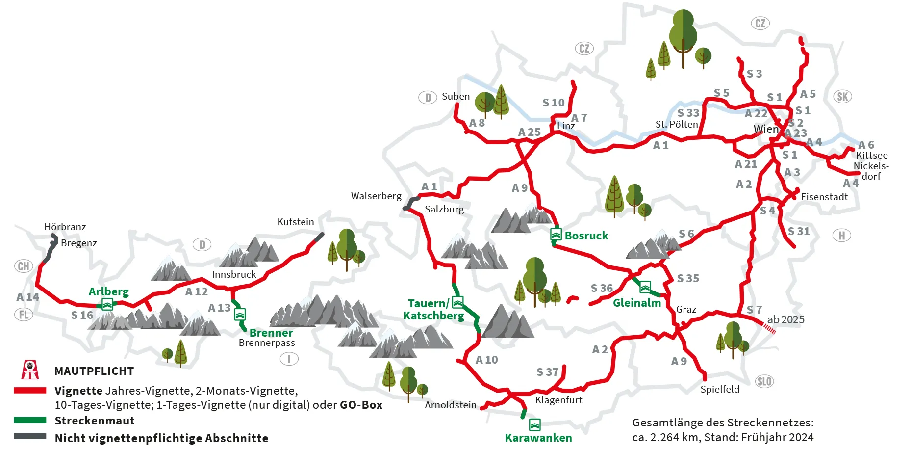

= Übungstest in POS
:source-highlighter: rouge
:icons: font
:pdf-page-header: true
:lang: DE
:hyphens:
ifndef::env-github[:icons: font]
ifdef::env-github[]
:caution-caption: :fire:
:important-caption: :exclamation:
:note-caption: :paperclip:
:tip-caption: :bulb:
:warning-caption: :warning:
endif::[]

== Teilaufgabe 1: Object Relation Mapping und Database Queries

Bilden Sie das dargestellte Modell entsprechend Ihres gewählten Technologie Stacks sauber ab.
Beachten Sie dabei die geforderten Anforderungen an einzelne Modellklassen.

[plantuml,format=svg]
----
include::diagram1.puml[]
----

=== Arbeitsauftrag

==== Erstellung der Datenbankzugriffe

Erstellen Sie die üblichen Datenbank Zugriffsobjekte ihres gewählten Technologie Stacks.
Fügen Sie - wenn es die Abfragen erleichtet - auch zusätzliche Navigations hinzu.
Bachten Sie Attribute Constraints wie *not null* (`nn`).
Setzen Sie folgende Abfragen um:

* Listen Sie alle Patienten auf, die innerhalb eines bestimmten Zeitraumes einen bestätigten
  Termin haben. Sie erkennen einen bestätigten Termin daran, dass einer der _AppoinmentStates_ den Typ _Confirmed_ besitzt.
  Geben Sie Vor- und Nachnamen, Email und Telefonnummer des Patienten sowie das Datum und die Zeit des Termines (_Appointment_) aus.

==== Verfassen von Tests

Stellen Sie durch automatisierte Tests sicher, dass:

* Sie alle Elemente des Modells richtig gemapped haben und diese in der DB gespeichert werden.
* Sie notwendige Umschlüsselungen (Richtypes, Enumerations) in beide Richtungen richtig implementiert haben.
* Die geforderten Abfragen die richtigen Ergebnisse liefern und nur die geforderten (!) Daten liefern.

[NOTE]
Wenn du einen Datensatz mit in Beziehung stehenden Daten einfügst, kannst du gleich mehrere Tabellen auf einmal testen.

== Teilaufgabe 2: Services und Unittests

In Österreich muss für die Benützung der Autobahnen und Schnellstraßen eine Gebühr bezahlt werden.
Durch den Kauf einer "Vignette" (im Modell _Sticker_ genannt) wird diese Gebühr bezahlt.
Es gibt Vignetten, die 10 Tage, 2 Monate oder 1 Jahr gültig sind.
Es gibt für Autos (PKW) und Motorräder verschiedene Tarife.
Zusätzlich gibt es noch Strecken mit sogenannter "Streckenmaut".
Für diese Strecken ist zusätzlich eine Maut zu entrichten.
Die Zahlungen werden im Modell durch _TollPayment_ repräsentiert. 

.https://www.asfinag.at/maut-vignette/streckenmaut/, 4.3.2025

Es wird Ihnen zu Testzwecken eine Datenzugriffs-Schnittstelle sowie die zur Implementierung notwendigen Datenklassen zur Verfügung gestellt.
Sie sollen kein OR-Mapping implementieren, sondern eine isolierte Umsetzung des Services anstreben.

[plantuml,format=svg]
----
include::diagram2.puml[]
----

=== Arbeitsauftrag

==== Implementierung von Servicemethoden

Schreiben Sie eine Methode zur statistischen Auswertung der Vignetten- und Mauteinnahmen für ein Kalenderjahr.
Dabei werden alle verkauften Vignetten, dessen _PurchaseDate_ im angegebenen Jahr liegt, berücksichtigt.
Zusätzlich werden auch alle Mautzahlungen (_TollPayment_), die im angegebenen Jahr getätigt wurden, berücksichtigt.

Die Methode soll folgende Informationen zurückgeben:

[%header,cols="1,3"]
|===
| Key | Value
| PassengerCar | Liste der Verkäufe
| Motorcycle | Liste der Verkäufe
|===

Die Liste der Verkäufe soll folgende Informationen enthalten:

[source,typescript]
----
{"CustomerFirstname": string, "CustomerLastname": string, "VehicleNumberplate": string, "PurchaseDate": DateTime, "Price": decimal, "Type": "Sticker"|"TollPayment"}
----

==== Verfassen von Tests

Stellen Sie durch automatisierte Tests sicher, dass:

* Sie die Statistik richtig berechnen und 
* die Datenstrukturen richtig sortiert bereitstellen.

== Teilaufgabe 3: REST(ful) API

Für das vorige Modell der Vignettenverkäufe soll eine RESTful API implementiert werden.

=== Arbeitsauftrag

Implementieren Sie die folgenden REST API Routen.
Testen Sie entsprechend des angegebenen Antwortverhaltens (Status-Code, Responses).

==== GET /vehicles/{numberplate}?includeStickers=false

Diese REST API Route soll ein bestimmtes Fahrzeug samt der gekauften Vignetten (_Sticker_)  retournieren.
Wird der optionale Parameter _includeStickers_ mit dem Wert true mitgegeben (false ist der Default-Wert), soll die Antwort die Vignetten enthalten.
Ist der parameter false, soll ein leeres Array zurückgegeben werden.

Das Kennzeichen soll mit Hilfe des regulären Ausdrucks `^[A-Z]{1,2}\d{2,7}[A-Z]{2,3}$` analysiert werden.
Sonderfälle wie Wunschkennzeichen, diplomatische Dienste oder sehr alte Kennzeichen sollen nicht berücksichtigt werden.

.Erwartete HTTP-Antworten:
[%header,cols="1,4"]
|===
| HTTP Status | Bedingung
| 200	| Ein _VehicleDto_, welches optional ein Array von _StickerDto_ enthält
| 400	| Für eine fehlerhaftes Kennzeichen (inkl. RFC-9457 ProblemDetail im Body)
| 404	| Für eine unbekanntes Kennzeichen (inkl. RFC-9457 ProblemDetail im Body)
|===

==== Schematische Response (_VehicleDto_):

[source,typescript]
----
{
    "numberplate": string,
    "customerFirstname": string,
    "customerLastname": string,
    "vehicleType": "PassengerCar"|"Motorcycle",
    "stickers": [
        {
            "purchaseDate": string,
            "validFrom": string,
            "validTo": string
            "price": number
        }
    ]
}
----

==== PATCH /vehicles/{numberplate}

Im Modell wird auch die Gültigkeit der § 57a Begutachtung ("Pickerl", englisch _MOT_) abgebildet.
Dieses Datum soll durch diesen PATCH Request gesetzt werden.

.Erwartete HTTP-Antworten:
[%header,cols="1,4"]
|===
| HTTP Status | Bedingung
| 200	| Ein _VehicleDto_ Objekt.
| 400	| Für ein fehlerhafres Kennzeichen. (inkl. RFC-9457 ProblemDetail im Body)
| 400	| Wenn das neue Datum kleiner als das gespeicherte _MotValidUntil_ Datum ist. (inkl. RFC-9457 ProblemDetail im Body)
| 404	| Für ein unbekanntes Kennzeichen (inkl. RFC-9457 ProblemDetail im Body)
|===

===== Payload (_UpdateVehicleCommand_):

[source,typescript]
----
{
    "motValidUntil": string,
}
----

==== Schematische Response (_VehicleDto_):

Siehe GET Route.
